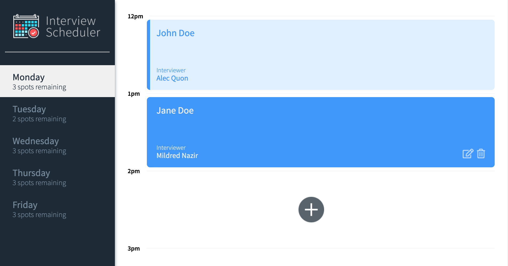
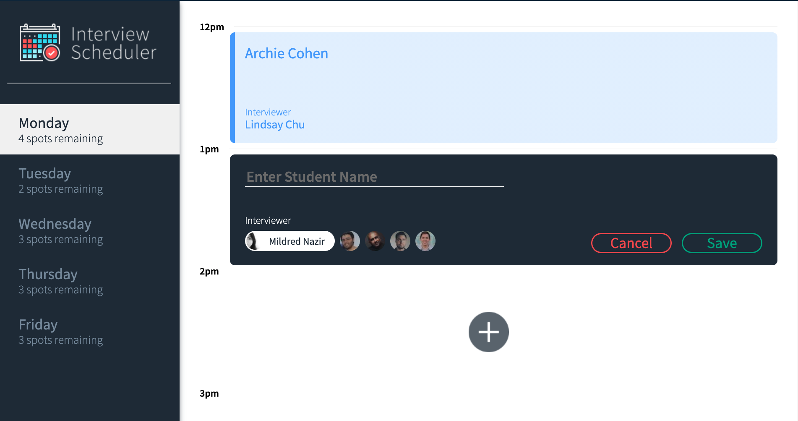
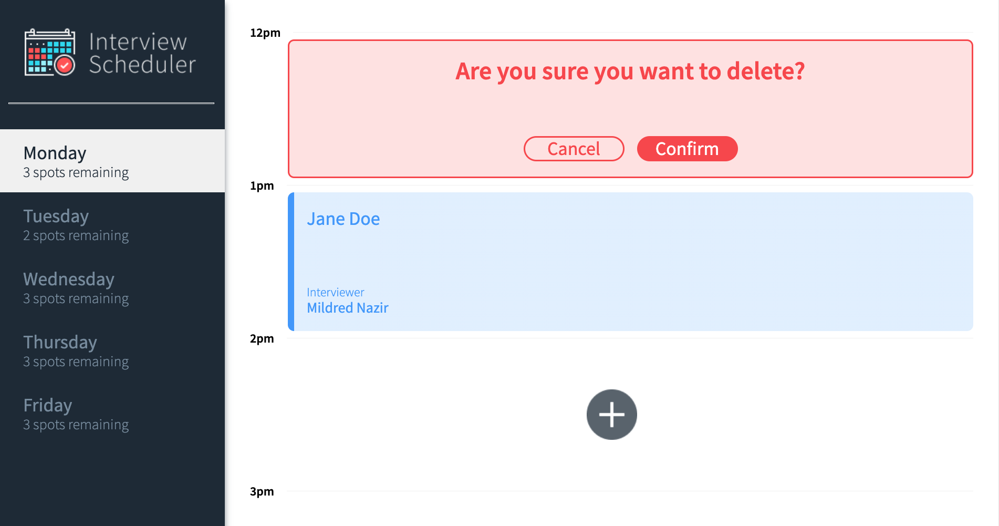

# Interview Scheduler

Interview Scheduler is a React application that helps users easily track their interview appointments. The user is able to book, edit or cancel their appointments for the week.


## Final Product 




## Stacks

- Front-End: HTML, SASS, React.js, 
- Back-End: Node.js, Express, PostgreSQL
- Testing: Cypress, Jest, Storybook 

## How It Works
---

### Booking An Appointment

- Select the day of the week with openings available that you'd like to book an appointment on. 
- Click on the "+" button at an open time slot that you are interested in.
- Enter your name, then select an interviewer and click on the save button if you'd like to go ahead and book this appointment, otherwise click on cancel to go back.

### Editing an Appointment
- Hover over the interview you'd like to edit and click on the edit button.
- In the edit menu, you will be able to change the name that was inputted and select a different interviewer.
- Once you have made your changes, click on the "Save" button to confirm your changes or click on "Cancel" to go back.

### Deleting An Appointment
- Hover over the interview that you'd like to delete and click on the delete button. 
- If you are sure that you would like to delete your appointment, click on "Confirm" and your appointment will be deleted, otherwise click on the "Cancel" to go back.


## Setup

1. Install dependencies with `npm install`.

2. Fork and clone [Schedule-Api](https://github.com/yusuf-abdulla3/scheduler-api).

3. While in the root of Scheduler-Api directory, run npm start to start the API server.

4. While in the root of the Scheduler directory, start the Webpack development server by running npm start. 

5. Once the API and Webpack servers are running, the app will run at [http://localhost:8000/](http://localhost:8000).


## Running Webpack Development Server

```sh
npm start
```

## Running Jest Test Framework

```sh
npm test
```

## Running Storybook Visual Testbed

```sh
npm run storybook
```

## Dependencies 
- axios
- classnames
- normalize.css
- react
- react-dom
- react-hooks-testing-library
- react-scripts
- react-test-renderer
